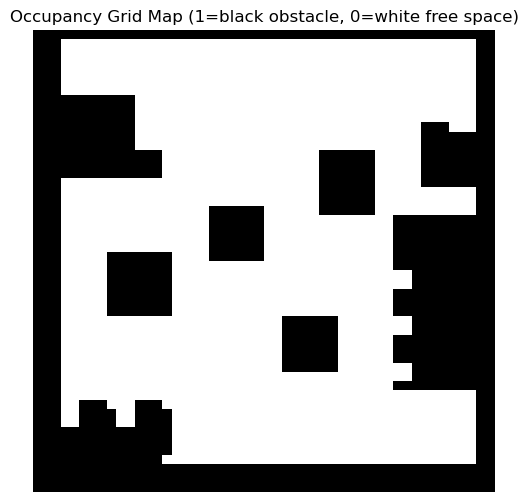
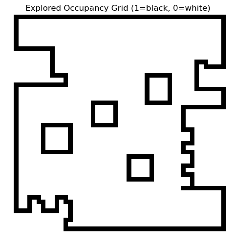

# Warehouse Robot Navigation — Occupancy-Grid Mapping & Path Planning

[](https://colab.research.google.com/github/AsserGharib1/WarehouseRobotPathPlanning/blob/main/warehouse_path_planning.ipynb)
[](https://nbviewer.org/github/AsserGharib1/WarehouseRobotPathPlanning/blob/main/warehouse_path_planning.ipynb)


Path planning for warehouse order-fulfillment robots on an occupancy-grid map: classical **A\*** and **Dijkstra** planners benchmarked across 20 test cases, with automatic replanning around dynamic obstacles (moving workers) simulated in pygame.

## Highlights

- **Occupancy-grid mapping**: environment explored and rasterized to a 0/1 grid (`explored_ogm.npy`, `manual_ogm.npy`), visualized with pygame.
- **A\* vs Dijkstra benchmark across 20 test cases**, comparing computation time and path length per case (full comparison table in the report).
- **Dynamic-obstacle replanning**: moving workers block precomputed paths; the robot detects the blockage and replans online — mimicking a realistic warehouse floor.
- Multi-target order fulfillment on the mapped grid, visualized step-by-step in pygame.
- Detailed write-up with figures in `docs/report.pdf`.

## Grid maps

Manually defined warehouse map and explored occupancy-grid map used by the planners:





## Repository contents

- `warehouse_path_planning.ipynb` — mapping, planners, simulation, and experiments (outputs preserved).
- `explored_map.png`, `*.npy` — grid maps used by the notebook.
- `docs/report.pdf` — project report.

## Running

```bash
pip install -r requirements.txt
jupyter notebook warehouse_path_planning.ipynb
```
